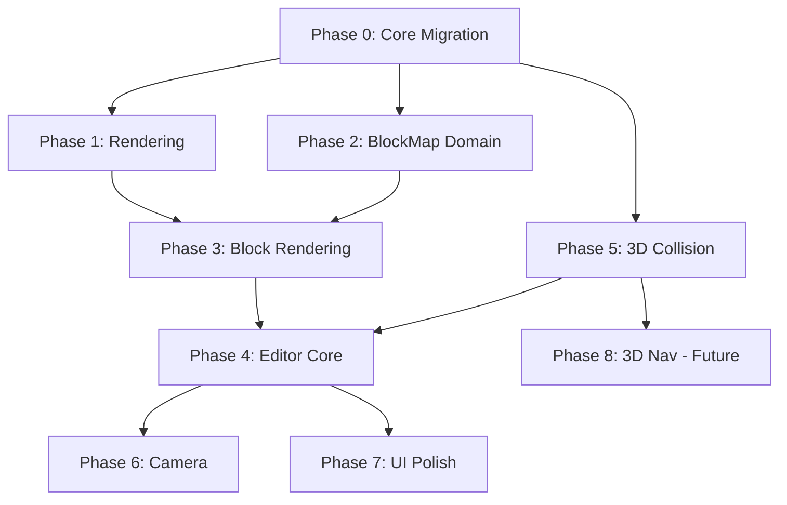

# Implementation Plan - 3D Block Map Editor (True 3D Architecture)

> [!IMPORTANT]
> **True 3D Foundation:** The world uses `WorldPosition` (X/Y/Z) with Y as vertical height. The isometric camera is just one view mode. This enables future first-person, cutscenes, etc.

> [!WARNING]
> **Performance & GC:** All implementations follow existing patterns: `[<Struct>]` DUs, `voption`, `Dictionary<K,V>`, `ArrayPool`, no allocations in hot paths.

---

## Phase 0: Core 3D Migration

> [!CAUTION]
> This phase touches core infrastructure. All existing functionality must continue working with Y=0.

- [ ] Task: Create `WorldPosition` type in `Domain/Core.fs`
    - `[<Struct>] type WorldPosition = { X: float32; Y: float32; Z: float32 }`
    - Helper: `WorldPosition.fromVector2 (v: Vector2) = { X = v.X; Y = 0f; Z = v.Y }`
    - Helper: `WorldPosition.toVector2 (p: WorldPosition) = Vector2(p.X, p.Z)`
- [ ] Task: Migrate `World.Positions` to `WorldPosition`
    - Change `Positions: Dictionary<EntityId, Vector2>` → `WorldPosition`
    - Update `StateWrite.UpdatePosition` command
- [ ] Task: Create `GridCell3D` in `Domain/Spatial.fs`
    - `[<Struct>] type GridCell3D = { X: int; Y: int; Z: int }`
    - Helper functions for cell ↔ world position conversion
- [ ] Task: Update `MovementSnapshot` in `Projections.fs`
    - `Positions: IReadOnlyDictionary<EntityId, WorldPosition>`
- [ ] Task: Update all systems using positions
    - Pattern: `position.X, position.Z` for XZ plane operations
    - Most distance checks continue working on XZ plane
- [ ] Task: Verification - All tests pass, game runs with Y=0

---

## Phase 1: Rendering with Height

- [ ] Task: Update `RenderMath.LogicRender.toRender`
    - Accept `WorldPosition` instead of `Vector2 + altitude`
    - Map `Y` to visual height
- [ ] Task: Update `EntityEmitter` for 3D positions
    - Read `Y` from `WorldPosition` for mesh placement
- [ ] Task: Update `ParticleEmitter` (already uses Vector3)
    - Verify compatibility with new coordinate system
- [ ] Task: Update `CameraService`
    - `ScreenToWorld` returns `WorldPosition` (with Y on ground plane)
    - `CreatePickRay` unchanged (already 3D)
- [ ] Task: Verification - Entities render correctly at Y=0

---

## Phase 2: Block Map Domain & Persistence

- [ ] Task: Create `Domain/BlockMap.fs`
    - `BlockType`, `PlacedBlock`, `BlockPalette`, `BlockMapDefinition`
    - All types with `[<Struct>]` where appropriate
- [ ] Task: Create `Loaders/BlockMapLoader.fs`
    - JDeck decoders for all BlockMap types
    - JDeck encoders for JSON serialization
    - Load/Save functions
- [ ] Task: Unit tests for serialization roundtrip
- [ ] Task: Create sample block palette JSON

---

## Phase 3: Block Rendering

- [ ] Task: Create `Rendering/BlockEmitter.fs`
    - `emitBlocks: BlockMapDefinition → MeshCommand[]`
    - Load models from palette paths
    - Position at `GridCell3D` world coordinates
    - Frustum culling
- [ ] Task: Integrate into `RenderOrchestratorV2`
    - Render blocks in mesh pass
    - Proper depth sorting with entities
- [ ] Task: Verification - Static blocks render at correct 3D positions

---

## Phase 4: Editor Core

- [ ] Task: Create `Editor/EditorState.fs`
    - FDA `cval<T>` for all state
    - `CurrentLayer`, `GridCursor`, `BrushMode`
- [ ] Task: Create `Editor/EditorScene.fs`
    - Scene setup and transitions
    - Register editor systems
- [ ] Task: Create `Editor/EditorInputSystem.fs`
    - Ray-to-grid intersection for 3D placement
    - Block placement/removal
    - Layer navigation (Page Up/Down)
- [ ] Task: Grid overlay rendering at current Y-level
- [ ] Task: Cursor preview (ghost block)
- [ ] Task: Undo/redo stack

---

## Phase 5: 3D Collision (Block-Based)

- [ ] Task: Create `Systems/BlockGridCollision.fs`
    - Build occupancy from solid blocks
    - `isBlocked(GridCell3D): bool`
- [ ] Task: Extend collision system for 3D
    - Check block occupancy at entity's Y-level
    - Add to existing collision pipeline
- [ ] Task: Entity-block collision response
    - Prevent walking through solid blocks
- [ ] Task: Verification - Entities blocked by solid blocks

---

## Phase 6: Camera Abstraction

- [ ] Task: Extend `CameraService` interface
    - Support multiple camera modes
    - Add free-fly camera for editor
- [ ] Task: Implement `FreeFlyCamera`
    - WASD + mouse for 3D navigation
    - Toggle in editor UI
- [ ] Task: Isometric camera unchanged for gameplay

---

## Phase 7: Editor UI & Polish

- [ ] Task: Block palette UI (minimal list)
- [ ] Task: Layer indicator and controls
- [ ] Task: Brush mode buttons
- [ ] Task: Save/Load buttons with file dialogs
- [ ] Task: Preview mode (spawn player, test map)

---

## Phase 8: 3D Navigation (Future)

> [!NOTE]
> This phase can be deferred. Basic block collision provides sufficient gameplay initially.

- [ ] Task: Create `BlockNavGrid` for 3D pathfinding
- [ ] Task: Handle ramp/stair transitions
- [ ] Task: Update AI pathfinding for height

---

## File Changes Summary

### New Files
| File | Purpose |
|------|---------|
| `Domain/BlockMap.fs` | Block map types |
| `Loaders/BlockMapLoader.fs` | JSON persistence |
| `Editor/EditorState.fs` | Reactive editor state |
| `Editor/EditorScene.fs` | Editor scene |
| `Editor/EditorInputSystem.fs` | Block placement |
| `Rendering/BlockEmitter.fs` | Block mesh emission |
| `Systems/BlockGridCollision.fs` | 3D block collision |

### Modified Files
| File | Change |
|------|--------|
| `Domain/Core.fs` | Add `WorldPosition` |
| `Domain/World.fs` | `Positions` → `WorldPosition` |
| `Domain/Spatial.fs` | Add `GridCell3D` |
| `Projections.fs` | `MovementSnapshot` with `WorldPosition` |
| `Systems/State.fs` | Update position commands |
| `Systems/*.fs` | Use XZ plane for 2D operations |
| `Graphics/RenderMath.fs` | Accept `WorldPosition` |
| `Rendering/EntityEmitter.fs` | Use Y for height |
| `Systems/RenderOrchestratorV2.fs` | Integrate `BlockEmitter` |

---

## Dependency Graph

