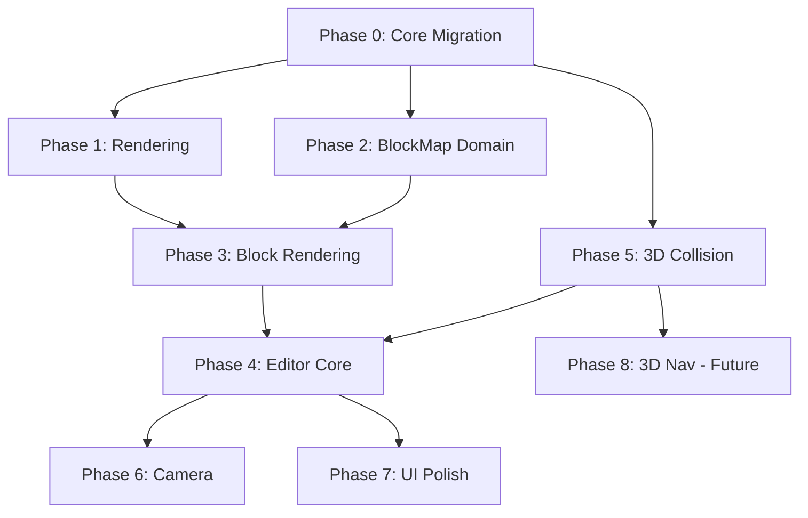

# Implementation Plan - 3D Block Map Editor (True 3D Architecture)

> [!IMPORTANT] > **True 3D Foundation:** The world uses `WorldPosition` (X/Y/Z) with Y as vertical height. The isometric camera is just one view mode.

> [!WARNING] > **Performance & GC:** All implementations follow existing patterns: `[<Struct>]` DUs, `voption`, `Dictionary<K,V>`, no allocations in hot paths.

> [!NOTE] > **Compile Between Phases:** Each phase must compile and run before moving to the next. Y=0 behavior preserved throughout migration.

---

## Phase 0: Core 3D Migration ✅

> [!CAUTION]
> This phase touches core infrastructure. All existing functionality must continue working with Y=0.

- [x] Task: Create `WorldPosition` type in `Domain/Core.fs`
  - `[<Struct>] type WorldPosition = { X: float32; Y: float32; Z: float32 }`
  - Helper: `WorldPosition.fromVector2 (v: Vector2) = { X = v.X; Y = 0f; Z = v.Y }`
  - Helper: `WorldPosition.toVector2 (p: WorldPosition) = Vector2(p.X, p.Z)`
- [x] Task: Migrate `World.Positions` to `WorldPosition`
  - Change `Positions: Dictionary<EntityId, Vector2>` → `WorldPosition`
  - Update `StateWrite.UpdatePosition` command
- [x] Task: Create `GridCell3D` in `Domain/Spatial.fs`
  - `[<Struct>] type GridCell3D = { X: int; Y: int; Z: int }`
  - Helper functions for cell ↔ world position conversion
- [x] Task: Update `MovementSnapshot` in `Projections.fs`
  - `Positions: IReadOnlyDictionary<EntityId, WorldPosition>`
- [x] Task: Update all systems using positions (see Migration Checklist below)
  - Pattern: `position.X, position.Z` for XZ plane operations
  - Use `WorldPosition.toVector2` where 2D is still appropriate
- [x] Task: Verification - Game compiles, runs with Y=0, no behavior change

### Migration Checklist (Vector2 → WorldPosition)

The following files contain `Vector2.Distance` or `Vector2` position logic:

| File                           | Change Required                         |
| ------------------------------ | --------------------------------------- |
| `Systems/AISystem.fs`          | Use XZ distance for perception          |
| `Systems/Collision.fs`         | XZ plane collision, Y for height blocks |
| `Systems/Combat.fs`            | XZ distance for AoE                     |
| `Systems/MovementLogic.fs`     | XZ waypoint distance                    |
| `Systems/Navigation.fs`        | XZ pathfinding                          |
| `Systems/Projectile.fs`        | XZ targeting, Y for altitude            |
| `Systems/Targeting.fs`         | XZ range validation                     |
| `Systems/AbilityActivation.fs` | XZ skill range                          |
| `Domain/Spatial.fs`            | Add `distanceXZ` helper                 |
| `Algorithms/Pathfinding.fs`    | XZ-only for now                         |
| `Projections.fs`               | MovementSnapshot update                 |

---

## Phase 1: Rendering with Height ✅

> [!NOTE]
> All Phase 1 tasks were completed as part of Phase 0 migration.

- [x] Task: Update `RenderMath.LogicRender.toRender`
  - Accept `WorldPosition` instead of `Vector2 + altitude`
  - Map `Y` to visual height
- [x] Task: Update `EntityEmitter` for 3D positions
  - `PoseResolver.resolveEntity` now takes `WorldPosition`, computes altitude, adds to Y
- [x] Task: Update `ParticleEmitter` (already uses Vector3)
  - Verified: Uses `WorldPosition.toVector3` for effect positions
- [x] Task: Update `CameraService`
  - `ScreenToWorld` returns `WorldPosition` (with Y=0 on ground plane)
  - `CreatePickRay` unchanged (already 3D)
- [x] Task: Verification - Game compiles, entities render correctly at Y=0

---

## Phase 2: Block Map Domain & Persistence ✅

- [x] Task: Create `Domain/BlockMap.fs`
  - `CollisionType` enum: `Box | Mesh of string | NoCollision`
  - `PlacedBlock` with `Rotation: Quaternion voption`
  - `BlockType` with `CollisionType`
  - `BlockMapDefinition` with embedded palette
  - All types with `[<Struct>]` where appropriate
- [x] Task: Create `Systems/BlockMapLoader.fs`
  - JDeck decoders including Quaternion
  - JDeck encoders for JSON serialization
  - Load/Save functions
- [x] Task: Unit tests for serialization roundtrip
- [x] Task: Create sample block palette JSON (empty map)

### Phase 2b: Map Objects Domain & Persistence

> [!NOTE]
> Extending the domain to support strongly typed map objects and settings.
> **Design Decision**: Zone effects use existing `Skill.Effect` type for seamless integration with ActiveEffect system.

#### BlockType Effect Extension

- [x] Task: Extend `BlockType` in `Domain/BlockMap.fs`
  - Add `Effect: Skill.Effect voption` to `BlockType`
  - Reuse existing `Skill.Effect` from `Pomo.Core.Domain.Skill` (includes Duration, Modifiers, etc.)
  - Add JDeck encoder/decoder for `Effect` field referencing `Skill.Serialization.Effect.decoder`

> [!TIP]
> Using `Skill.Effect` means lava blocks can have DoT with elemental damage, ice blocks can apply speed debuffs with stacking rules, etc.

#### Map Settings

- [x] Task: Add `MapSettings` to `Domain/BlockMap.fs`
  - `EngagementMode` DU: `Peaceful | PvE | PvP | FFA`
  - `MapSettings` struct: `{ EngagementMode; MaxEnemyEntities }`
  - Add `Settings: MapSettings` field to `BlockMapDefinition`

#### Map Objects

- [x] Task: Add `MapObject` types to `Domain/BlockMap.fs`
  - `MapObjectShape` DU: `Box of Vector3 | Sphere of float32` (no Point)
  - `SpawnProperties` struct: `{ IsPlayerSpawn; EntityGroup; MaxSpawns; Faction }`
  - `TeleportProperties` struct: `{ TargetMap; TargetObjectName }`
  - `MapObjectData` DU: `Spawn | Teleport | Trigger` (no Zone – handled by BlockType.Effect)
  - `MapObject` struct: `{ Id; Name; Position; Rotation; Shape; Data }`
  - Add `Objects: Dictionary<int, MapObject>` to `BlockMapDefinition`

#### Persistence Updates

- [x] Task: Update `Systems/BlockMapLoader.fs`

  - Add JDeck encoders/decoders for all new types
  - Reference existing `Skill.Serialization.Effect.decoder` for block effects

- [x] Task: Update serialization roundtrip tests

---

## Phase 3: Block Rendering ✅

- [x] Task: Create `Rendering/BlockEmitter.fs`
  - `emitBlocks: BlockMapDefinition → MeshCommand[]`
  - Load models from palette paths
  - Apply `Quaternion` rotation to mesh transforms
  - Position at `GridCell3D` world coordinates
  - Frustum culling
- [x] Task: Integrate into `RenderOrchestratorV2`
  - Render blocks in mesh pass
  - Proper depth sorting with entities
- [x] Task: Verification - Rotated blocks render correctly

---

## Phase 4: Editor Core ✅

- [x] Task: Create `Editor/EditorState.fs`
  - FDA `cval<T>` for all state
  - `CurrentLayer`, `GridCursor`, `BrushMode`, `CurrentRotation`
- [x] Task: Create `Editor/EditorScene.fs`
  - Scene setup and transitions
  - Register editor systems
- [x] Task: Create `Editor/EditorInputSystem.fs`
  - Ray-to-grid intersection for 3D placement
  - Block placement/removal with rotation
  - Layer navigation (Page Up/Down)
  - Rotation controls (gizmo or angle sliders)
- [x] Task: Grid overlay rendering at current Y-level
- [x] Task: Cursor preview (ghost block with current rotation)
- [x] Task: Undo/redo stack

---

## Phase 5: 3D Collision

- [x] Task: Extend `Domain/Spatial.fs` with `GridCell3D`
  - 3D spatial grid (extends existing 2D pattern)
  - `getCellsInRadius3D`, `getGridCell3D`
- [x] Task: Create `Systems/BlockCollision.fs`
  - **Box collision**: Fast AABB for `CollisionType.Box`
  - **Mesh collision**: Ray-surface for `CollisionType.Mesh`
  - Skip blocks with `CollisionType.NoCollision`
  - `getSurfaceHeight`, `isBlocked`, `applyCollision` functions
- [x] Task: Add `Movement3DSnapshot` to `Projections.fs`
  - `SpatialGrid3D: Dictionary<GridCell3D, EntityId[]>`
  - `GetNearbyEntities3DSnapshot` with GC-friendly iteration
- [ ] Task: Integrate into movement system
  - Entity Y follows surface height on mesh blocks (slopes)
  - Entity blocked by Box blocks at same height
- [ ] Task: Verification - Walk up/down rotated slope blocks

---

## Phase 5b: 3D System Alternatives

> [!NOTE]
> Full 3D versions of systems. **Requirements:**
>
> - Module functions over class methods
> - Factory functions returning object expressions
> - GC-friendly, avoid allocations in hot paths

---

### Domain Updates

- [ ] Task: Extend `SpawnData` in `BlockMap.fs`

  ```fsharp
  type SpawnData = {
    GroupId: string
    SpawnChance: float32
    Faction: Faction voption        // NEW
    ArchetypeId: string voption     // NEW
  }
  ```

- [ ] Task: Add `ProjectileTarget3D` to `Projectile.fs`

  ```fsharp
  type ProjectileTarget3D =
    | EntityTarget of Guid<EntityId>
    | PositionTarget of WorldPosition
  ```

- [ ] Task: Add `MovingAlongPath3D` to `Navigation.fs` domain
  ```fsharp
  type MovementState =
    | ...
    | MovingAlongPath3D of WorldPosition list
  ```

---

### Collision Strategy (Critical)

> [!WARNING] > **MTV collision DOES NOT work for 3D map objects like trees.** It produces invisible wall effects.

| Collision Type                  | System                                                                                  | Use For                                      |
| ------------------------------- | --------------------------------------------------------------------------------------- | -------------------------------------------- |
| `BlockCollision.applyCollision` | [BlockCollision.fs](file:///home/amunoz/repos/Kipo/Pomo.Core/Systems/BlockCollision.fs) | Map/terrain collision (blocks, trees, walls) |
| MTV Sliding                     | [Physics.fs](file:///home/amunoz/repos/Kipo/Pomo.Core/Algorithms/Physics.fs)            | Entity-entity collision only                 |

**Within BlockCollision (dual-strategy):**

| CollisionType | Method                   | Use For                          |
| ------------- | ------------------------ | -------------------------------- |
| `Box`         | Fast AABB check          | Regular solid blocks             |
| `Mesh`        | Ray-surface intersection | Rotated slopes, complex geometry |
| `NoCollision` | Skip                     | Decorations, passthrough         |

- [ ] Task: Update `calculate3DSnapshot` in `Projections.fs`
  - Call `BlockCollision.applyCollision` for each entity
  - MTV sliding remains for entity-entity separation in `CollisionSystem`

---

### 3D Skill Targeting (Critical)

> [!IMPORTANT]
> Current skill targeting uses 2D shapes (`Vector2`). All skills need 3D equivalents:

| 2D Shape | 3D Replacement | Use Case               |
| -------- | -------------- | ---------------------- |
| `Circle` | `Sphere`       | AOE centered on target |
| `Cone`   | `Cone3D`       | Frontal attacks        |
| `Line`   | `Cylinder`     | Beam/projectile path   |

- [ ] Task: Create `Domain/Spatial3D.fs`

  ```fsharp
  module Spatial3D =
    [<Struct>] type Sphere = { Center: WorldPosition; Radius: float32 }
    [<Struct>] type Cone3D = { Origin: WorldPosition; Direction: Vector3; AngleDeg: float32; Length: float32 }
    [<Struct>] type Cylinder = { Base: WorldPosition; Height: float32; Radius: float32 }

    module Search =
      type SearchContext3D = {
        GetNearbyEntities: WorldPosition -> float32 -> IndexList<EntityId * WorldPosition>
      }
      val findTargetsInSphere: SearchContext3D -> SphereRequest -> IndexList<EntityId>
      val findTargetsInCone3D: SearchContext3D -> Cone3DRequest -> IndexList<EntityId>
      val findTargetsInCylinder: SearchContext3D -> CylinderRequest -> IndexList<EntityId>
  ```

- [ ] Task: Update skill definitions to use 3D targeting types
- [ ] Task: Update `AbilityActivation.fs` to use `GetNearbyEntities3DSnapshot`

---

### Camera3D Module

- [ ] Task: Add `Camera3D` module to `Domain/Camera.fs`
  - Move logic from `Editor/Camera.fs`
  - Immutable state, pass-through updates
  ```fsharp
  module Camera3D =
    type State = { Position: Vector3; Yaw: float32; Pitch: float32; Zoom: float32 }
    val getViewMatrix: State -> Matrix
    val getProjectionMatrix: State -> Viewport -> pixelsPerUnit:float32 -> Matrix
    val getPickRay: State -> Vector2 -> Viewport -> pixelsPerUnit:float32 -> Ray
    val screenToWorld: State -> Vector2 -> Viewport -> pixelsPerUnit:float32 -> layer:float32 -> WorldPosition
    val panXZ: State -> deltaX:float32 -> deltaZ:float32 -> State
    val moveFreeFly: State -> Vector3 -> State
    val rotate: State -> deltaYaw:float32 -> deltaPitch:float32 -> State
    val zoom: State -> delta:float32 -> State
  ```

---

### Pathfinding3D Module

- [ ] Task: Create `Algorithms/Pathfinding3D.fs`
  - 3D A\* on BlockMap grid
  - Walkable = empty cell OR `NoCollision` block, with solid floor below
  ```fsharp
  module Pathfinding3D =
    type NavGrid3D = { BlockMap: BlockMapDefinition; CellSize: float32 }
    val isWalkable: NavGrid3D -> GridCell3D -> bool
    val getNeighbors: NavGrid3D -> GridCell3D -> GridCell3D[]  // 6 or 26 neighbors
    val findPath: NavGrid3D -> WorldPosition -> WorldPosition -> WorldPosition list voption
    val hasLineOfSight: NavGrid3D -> WorldPosition -> WorldPosition -> bool
  ```

---

### Navigation3D Module

- [ ] Task: Create `Systems/Navigation3D.fs`
  - Factory returning `CoreEventListener`
  - Uses `Pathfinding3D` and `Movement3DSnapshot`
  ```fsharp
  module Navigation3D =
    val create:
      eventBus: EventBus *
      stateWrite: IStateWriteService *
      projections: ProjectionService -> CoreEventListener
  ```

---

### BlockMapSpawning Module

- [ ] Task: Create `BlockMapSpawning.fs`
  - Read spawn points from `BlockMapDefinition.Objects`
  ```fsharp
  module BlockMapSpawning =
    val getSpawnPoints: BlockMapDefinition -> MapObject list
    val getSpawnsByGroup: BlockMapDefinition -> groupId:string -> MapObject list
    val getSpawnsByFaction: BlockMapDefinition -> Faction -> MapObject list
  ```

---

### Projectile3D Module

- [ ] Task: Create `Systems/Projectile3D.fs`
  - 3D projectile movement and targeting
  - Uses `GetNearbyEntities3DSnapshot` for chain targeting
  ```fsharp
  module Projectile3D =
    type WorldContext = {
      Positions: IReadOnlyDictionary<EntityId, WorldPosition>
      LiveEntities: HashSet<EntityId>
    }
    type ProjectileContext = {
      Id: Guid<EntityId>
      Position: WorldPosition
      TargetPosition: WorldPosition
      Projectile: LiveProjectile
    }
    val processProjectile: IStateWriteService -> WorldContext -> dt:float32 -> EntityId -> LiveProjectile -> IndexList<GameEvent>
    val findChainTargets: WorldContext -> WorldPosition -> maxRange:float32 -> excludeId:EntityId -> struct (EntityId * float32)[]
  ```

---

### Combat3D Targeting Module

- [ ] Task: Create `Systems/Combat3D.fs` or extend `Combat.fs`
  - 3D skill targeting resolution
  ```fsharp
  module Combat3D =
    type EntityContext3D = {
      Positions: IReadOnlyDictionary<EntityId, WorldPosition>
      DerivedStats: HashMap<EntityId, DerivedStats>
      Factions: HashMap<EntityId, Faction>
    }
    module Targeting =
      val resolveSphere: EntityContext3D -> center:WorldPosition -> radius:float32 -> EntityId list
      val resolveCone3D: EntityContext3D -> casterId:EntityId -> target:WorldPosition -> aperture:float32 -> range:float32 -> EntityId list
      val resolveLine3D: EntityContext3D -> start:WorldPosition -> end:WorldPosition -> width:float32 -> EntityId list
      val resolveBox: EntityContext3D -> center:WorldPosition -> halfExtents:Vector3 -> EntityId list
  ```

---

### Verification

- [ ] Build after each module
- [ ] Camera3D: View/projection matrix test
- [ ] Pathfinding3D: Unit test path finding
- [ ] Navigation3D: Entity movement toward 3D target
- [ ] Projectile3D: Projectile flies in 3D space

---

## Phase 6: Camera Abstraction

- [ ] Task: Extend `CameraService` interface
  - Support multiple camera modes
  - Add free-fly camera for editor
- [ ] Task: Implement `FreeFlyCamera`
  - WASD + mouse for 3D navigation
  - Toggle in editor UI
- [ ] Task: Isometric camera unchanged for gameplay

---

## Phase 7: Editor Integration & UI

- [ ] Task: Register `EditorScene` in `Scenes.fs` / `CompositionRoot.fs`
- [ ] Task: Add "Map Editor" menu entry in MainMenu
- [ ] Task: Wire editor input bindings in `InputMapping.fs`
- [ ] Task: Block palette UI (minimal list)
- [ ] Task: Layer indicator and controls
- [ ] Task: Brush mode buttons
- [ ] Task: Save/Load buttons with file dialogs
- [ ] Task: Preview mode (spawn player, test map)
- [ ] Task: **Map Settings UI** (Side panel for global map properties)
- [ ] Task: **Object Tool**
  - Separate tool mode for placing Objects vs Blocks
  - Visualizers (Wireframe box for zones, Icons for spawns)
- [ ] Task: **Object Inspector**
  - Edit properties of selected object (Spawn group, Zone effect, etc.)

---

## Phase 8: 3D Navigation (Future)

> [!NOTE]
> Defer until needed. Block collision + XZ pathfinding works initially.

- [ ] Task: Create `BlockNavGrid` for 3D pathfinding
- [ ] Task: Handle ramp/stair transitions
- [ ] Task: Update AI pathfinding for height

---

## Testing Philosophy

> [!CAUTION] > **No tests for the sake of testing.** Tests must represent real use cases. If bugs are found, replicate in tests, fix, and keep the test.

**Required Tests:**

- Serialization roundtrip (JDeck encode → decode → equal)
- Any bugs discovered during implementation → replicated and fixed

**NOT Required:**

- Redundant coverage tests
- Tests that just "prove it compiles"
- Mocking tests that don't exercise real code paths

---

## File Changes Summary

### New Files

| File                          | Purpose               |
| ----------------------------- | --------------------- |
| `Domain/BlockMap.fs`          | Block map types       |
| `Loaders/BlockMapLoader.fs`   | JSON persistence      |
| `Editor/EditorState.fs`       | Reactive editor state |
| `Editor/EditorScene.fs`       | Editor scene          |
| `Editor/EditorInputSystem.fs` | Block placement       |
| `Rendering/BlockEmitter.fs`   | Block mesh emission   |
| `Systems/BlockCollision.fs`   | Box + mesh collision  |

---

## Dependency Graph


