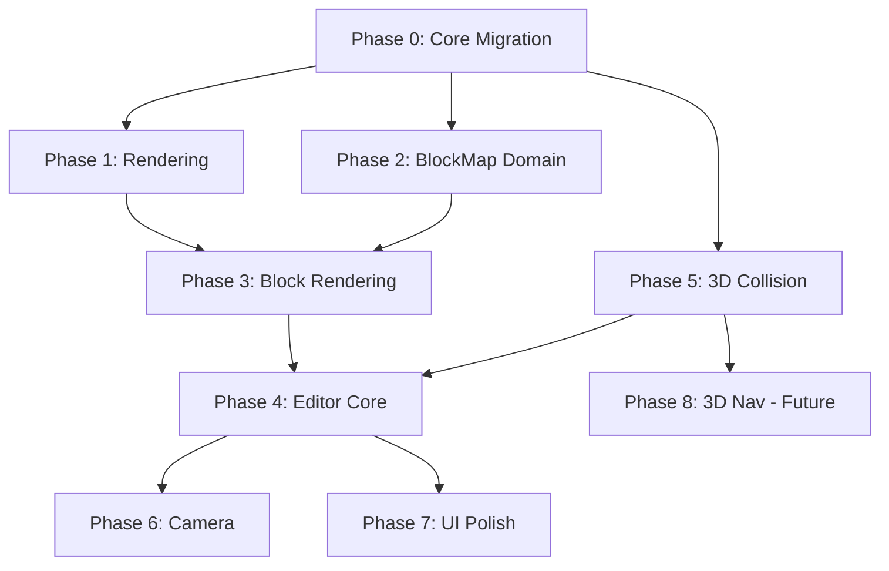

# Implementation Plan - 3D Block Map Editor (True 3D Architecture)

> [!IMPORTANT] > **True 3D Foundation:** The world uses `WorldPosition` (X/Y/Z) with Y as vertical height. The isometric camera is just one view mode.

> [!WARNING] > **Performance & GC:** All implementations follow existing patterns: `[<Struct>]` DUs, `voption`, `Dictionary<K,V>`, no allocations in hot paths.

> [!NOTE] > **Compile Between Phases:** Each phase must compile and run before moving to the next. Y=0 behavior preserved throughout migration.

---

## Phase 0: Core 3D Migration ✅

> [!CAUTION]
> This phase touches core infrastructure. All existing functionality must continue working with Y=0.

- [x] Task: Create `WorldPosition` type in `Domain/Core.fs`
  - `[<Struct>] type WorldPosition = { X: float32; Y: float32; Z: float32 }`
  - Helper: `WorldPosition.fromVector2 (v: Vector2) = { X = v.X; Y = 0f; Z = v.Y }`
  - Helper: `WorldPosition.toVector2 (p: WorldPosition) = Vector2(p.X, p.Z)`
- [x] Task: Migrate `World.Positions` to `WorldPosition`
  - Change `Positions: Dictionary<EntityId, Vector2>` → `WorldPosition`
  - Update `StateWrite.UpdatePosition` command
- [x] Task: Create `GridCell3D` in `Domain/Spatial.fs`
  - `[<Struct>] type GridCell3D = { X: int; Y: int; Z: int }`
  - Helper functions for cell ↔ world position conversion
- [x] Task: Update `MovementSnapshot` in `Projections.fs`
  - `Positions: IReadOnlyDictionary<EntityId, WorldPosition>`
- [x] Task: Update all systems using positions (see Migration Checklist below)
  - Pattern: `position.X, position.Z` for XZ plane operations
  - Use `WorldPosition.toVector2` where 2D is still appropriate
- [x] Task: Verification - Game compiles, runs with Y=0, no behavior change

### Migration Checklist (Vector2 → WorldPosition)

The following files contain `Vector2.Distance` or `Vector2` position logic:

| File                           | Change Required                         |
| ------------------------------ | --------------------------------------- |
| `Systems/AISystem.fs`          | Use XZ distance for perception          |
| `Systems/Collision.fs`         | XZ plane collision, Y for height blocks |
| `Systems/Combat.fs`            | XZ distance for AoE                     |
| `Systems/MovementLogic.fs`     | XZ waypoint distance                    |
| `Systems/Navigation.fs`        | XZ pathfinding                          |
| `Systems/Projectile.fs`        | XZ targeting, Y for altitude            |
| `Systems/Targeting.fs`         | XZ range validation                     |
| `Systems/AbilityActivation.fs` | XZ skill range                          |
| `Domain/Spatial.fs`            | Add `distanceXZ` helper                 |
| `Algorithms/Pathfinding.fs`    | XZ-only for now                         |
| `Projections.fs`               | MovementSnapshot update                 |

---

## Phase 1: Rendering with Height ✅

> [!NOTE]
> All Phase 1 tasks were completed as part of Phase 0 migration.

- [x] Task: Update `RenderMath.LogicRender.toRender`
  - Accept `WorldPosition` instead of `Vector2 + altitude`
  - Map `Y` to visual height
- [x] Task: Update `EntityEmitter` for 3D positions
  - `PoseResolver.resolveEntity` now takes `WorldPosition`, computes altitude, adds to Y
- [x] Task: Update `ParticleEmitter` (already uses Vector3)
  - Verified: Uses `WorldPosition.toVector3` for effect positions
- [x] Task: Update `CameraService`
  - `ScreenToWorld` returns `WorldPosition` (with Y=0 on ground plane)
  - `CreatePickRay` unchanged (already 3D)
- [x] Task: Verification - Game compiles, entities render correctly at Y=0

---

## Phase 2: Block Map Domain & Persistence ✅

- [x] Task: Create `Domain/BlockMap.fs`
  - `CollisionType` enum: `Box | Mesh of string | NoCollision`
  - `PlacedBlock` with `Rotation: Quaternion voption`
  - `BlockType` with `CollisionType`
  - `BlockMapDefinition` with embedded palette
  - All types with `[<Struct>]` where appropriate
- [x] Task: Create `Systems/BlockMapLoader.fs`
  - JDeck decoders including Quaternion
  - JDeck encoders for JSON serialization
  - Load/Save functions
- [x] Task: Unit tests for serialization roundtrip
- [x] Task: Create sample block palette JSON (empty map)

---

## Phase 3: Block Rendering

- [ ] Task: Create `Rendering/BlockEmitter.fs`
  - `emitBlocks: BlockMapDefinition → MeshCommand[]`
  - Load models from palette paths
  - Apply `Quaternion` rotation to mesh transforms
  - Position at `GridCell3D` world coordinates
  - Frustum culling
- [ ] Task: Integrate into `RenderOrchestratorV2`
  - Render blocks in mesh pass
  - Proper depth sorting with entities
- [ ] Task: Verification - Rotated blocks render correctly

---

## Phase 4: Editor Core

- [ ] Task: Create `Editor/EditorState.fs`
  - FDA `cval<T>` for all state
  - `CurrentLayer`, `GridCursor`, `BrushMode`, `CurrentRotation`
- [ ] Task: Create `Editor/EditorScene.fs`
  - Scene setup and transitions
  - Register editor systems
- [ ] Task: Create `Editor/EditorInputSystem.fs`
  - Ray-to-grid intersection for 3D placement
  - Block placement/removal with rotation
  - Layer navigation (Page Up/Down)
  - Rotation controls (gizmo or angle sliders)
- [ ] Task: Grid overlay rendering at current Y-level
- [ ] Task: Cursor preview (ghost block with current rotation)
- [ ] Task: Undo/redo stack

---

## Phase 5: 3D Collision

- [ ] Task: Extend `Domain/Spatial.fs` with `GridCell3D`
  - 3D spatial grid (extends existing 2D pattern)
  - `getCellsInRadius3D`, `getGridCell3D`
- [ ] Task: Create `Systems/BlockCollision.fs`
  - **Box collision**: Fast AABB for `CollisionType.Box`
  - **Mesh collision**: Ray-surface for `CollisionType.Mesh`
    - Load collision mesh, apply block rotation
    - Raycast down to find surface height
  - Skip blocks with `CollisionType.NoCollision`
- [ ] Task: Integrate into movement system
  - Entity Y follows surface height on mesh blocks (slopes)
  - Entity blocked by Box blocks at same height
- [ ] Task: Verification - Walk up/down rotated slope blocks

---

## Phase 6: Camera Abstraction

- [ ] Task: Extend `CameraService` interface
  - Support multiple camera modes
  - Add free-fly camera for editor
- [ ] Task: Implement `FreeFlyCamera`
  - WASD + mouse for 3D navigation
  - Toggle in editor UI
- [ ] Task: Isometric camera unchanged for gameplay

---

## Phase 7: Editor Integration & UI

- [ ] Task: Register `EditorScene` in `Scenes.fs` / `CompositionRoot.fs`
- [ ] Task: Add "Map Editor" menu entry in MainMenu
- [ ] Task: Wire editor input bindings in `InputMapping.fs`
- [ ] Task: Block palette UI (minimal list)
- [ ] Task: Layer indicator and controls
- [ ] Task: Brush mode buttons
- [ ] Task: Save/Load buttons with file dialogs
- [ ] Task: Preview mode (spawn player, test map)

---

## Phase 8: 3D Navigation (Future)

> [!NOTE]
> Defer until needed. Block collision + XZ pathfinding works initially.

- [ ] Task: Create `BlockNavGrid` for 3D pathfinding
- [ ] Task: Handle ramp/stair transitions
- [ ] Task: Update AI pathfinding for height

---

## Testing Philosophy

> [!CAUTION] > **No tests for the sake of testing.** Tests must represent real use cases. If bugs are found, replicate in tests, fix, and keep the test.

**Required Tests:**

- Serialization roundtrip (JDeck encode → decode → equal)
- Any bugs discovered during implementation → replicated and fixed

**NOT Required:**

- Redundant coverage tests
- Tests that just "prove it compiles"
- Mocking tests that don't exercise real code paths

---

## File Changes Summary

### New Files

| File                          | Purpose               |
| ----------------------------- | --------------------- |
| `Domain/BlockMap.fs`          | Block map types       |
| `Loaders/BlockMapLoader.fs`   | JSON persistence      |
| `Editor/EditorState.fs`       | Reactive editor state |
| `Editor/EditorScene.fs`       | Editor scene          |
| `Editor/EditorInputSystem.fs` | Block placement       |
| `Rendering/BlockEmitter.fs`   | Block mesh emission   |
| `Systems/BlockCollision.fs`   | Box + mesh collision  |

---

## Dependency Graph

