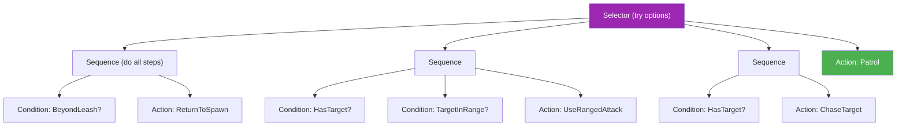

# Decision Tree Authoring Guide

**For Designers: Customizing AI Behavior**

Decision trees control how enemies and NPCs make decisions in combat. By editing `DecisionTrees.json`, you can create new behavior patterns without writing code.

---

## Understanding Behavior Trees

A behavior tree is like a flowchart the AI follows every decision cycle:



---

## Node Types

### Selector (OR Logic)

Tries each child **until one succeeds**. Like asking "Can I do A? No? How about B? No? How about C?"

```json
{
  "Type": "Selector",
  "Children": [ ... ]
}
```

### Sequence (AND Logic)

Runs each child **in order, all must succeed**. Like a checklist where every item must pass.

```json
{
  "Type": "Sequence",
  "Children": [ ... ]
}
```

### Condition

A yes/no check. Returns success if the condition is true.

```json
{ "Type": "Condition", "Name": "HasTarget" }
```

### Action

Something the AI does. Returns success when complete.

```json
{ "Type": "Action", "Name": "ChaseTarget" }
```

### Inverter

Flips the result of its child (success becomes failure, failure becomes success).

```json
{ "Type": "Inverter", "Child": { ... } }
```

---

## Available Conditions

These are the checks you can use in decision trees:

| Condition            | Parameters                  | What It Checks                                         |
| -------------------- | --------------------------- | ------------------------------------------------------ |
| `HasTarget`          | —                           | Does the AI have a current target?                     |
| `TargetInRange`      | `Range` (optional)          | Is target within attack range?                         |
| `TargetInMeleeRange` | —                           | Is target within melee distance?                       |
| `TargetTooClose`     | `MinDistance` (default: 48) | Is target closer than minimum distance?                |
| `SelfHealthBelow`    | `Threshold` (default: 0.3)  | Is AI's health below X%? (0.3 = 30%)                   |
| `TargetHealthBelow`  | `Threshold` (default: 0.3)  | Is target's health below X%?                           |
| `BeyondLeash`        | —                           | Has AI wandered too far from spawn?                    |
| `SkillReady`         | —                           | Is any skill off cooldown?                             |
| `HasCue`             | —                           | Has the AI perceived something (visual, damage, etc.)? |
| `CueResponseIs`      | `Response`                  | Is the current cue response a specific type?           |

### Using Parameters

```json
{
  "Type": "Condition",
  "Name": "SelfHealthBelow",
  "Params": { "Threshold": "0.5" }
}
```

---

## Available Actions

These are the things the AI can do:

| Action            | What It Does                                         |
| ----------------- | ---------------------------------------------------- |
| `ChaseTarget`     | Move toward current target                           |
| `UseRangedAttack` | Use a ranged skill on target                         |
| `UseMeleeAttack`  | Use a melee skill on target                          |
| `UseHeal`         | Cast a healing skill (on self or ally)               |
| `UseDebuff`       | Cast a debuff on target                              |
| `UseBuff`         | Cast a buff (on self or ally)                        |
| `Patrol`          | Follow patrol waypoints if defined, otherwise wander |
| `ReturnToSpawn`   | Move back toward spawn position                      |
| `Retreat`         | Move away from target                                |
| `Idle`            | Do nothing this cycle                                |

---

## Example: Simple Ranged Attacker

```json
"RangedCaster": {
  "Root": {
    "Type": "Selector",
    "Children": [
      {
        "Type": "Sequence",
        "Children": [
          { "Type": "Condition", "Name": "BeyondLeash" },
          { "Type": "Action", "Name": "ReturnToSpawn" }
        ]
      },
      {
        "Type": "Sequence",
        "Children": [
          { "Type": "Condition", "Name": "HasTarget" },
          { "Type": "Condition", "Name": "TargetInRange" },
          { "Type": "Action", "Name": "UseRangedAttack" }
        ]
      },
      {
        "Type": "Sequence",
        "Children": [
          { "Type": "Condition", "Name": "HasTarget" },
          { "Type": "Action", "Name": "ChaseTarget" }
        ]
      },
      { "Type": "Action", "Name": "Patrol" }
    ]
  }
}
```

**Reading this tree:**

1. **First**, check if beyond leash → return to spawn if true
2. **Else**, if has target AND in range → attack
3. **Else**, if has target → chase them
4. **Else**, patrol

---

## Example: Kiting Ranged (Retreats When Close)

```json
"TacticalRanged": {
  "Root": {
    "Type": "Selector",
    "Children": [
      {
        "Type": "Sequence",
        "Children": [
          { "Type": "Condition", "Name": "BeyondLeash" },
          { "Type": "Action", "Name": "ReturnToSpawn" }
        ]
      },
      {
        "Type": "Sequence",
        "Children": [
          {
            "Type": "Condition",
            "Name": "TargetTooClose",
            "Params": { "MinDistance": "48" }
          },
          { "Type": "Action", "Name": "Retreat" }
        ]
      },
      {
        "Type": "Sequence",
        "Children": [
          { "Type": "Condition", "Name": "HasTarget" },
          { "Type": "Condition", "Name": "TargetInRange" },
          { "Type": "Action", "Name": "UseRangedAttack" }
        ]
      },
      {
        "Type": "Sequence",
        "Children": [
          { "Type": "Condition", "Name": "HasTarget" },
          { "Type": "Action", "Name": "ChaseTarget" }
        ]
      },
      { "Type": "Action", "Name": "Patrol" }
    ]
  }
}
```

The key difference: **retreats if enemy gets too close** (within 48 pixels).

---

## Example: Support That Self-Heals

```json
"SupportBuffer": {
  "Root": {
    "Type": "Selector",
    "Children": [
      {
        "Type": "Sequence",
        "Children": [
          { "Type": "Condition", "Name": "BeyondLeash" },
          { "Type": "Action", "Name": "ReturnToSpawn" }
        ]
      },
      {
        "Type": "Sequence",
        "Children": [
          {
            "Type": "Condition",
            "Name": "SelfHealthBelow",
            "Params": { "Threshold": "0.3" }
          },
          { "Type": "Action", "Name": "UseHeal" }
        ]
      },
      {
        "Type": "Sequence",
        "Children": [
          { "Type": "Condition", "Name": "HasTarget" },
          { "Type": "Action", "Name": "UseDebuff" }
        ]
      },
      { "Type": "Action", "Name": "Patrol" }
    ]
  }
}
```

**Priority**: Heal self when below 30% HP, otherwise debuff enemies.

---

## Design Patterns

### Priority Pattern

Put the most important behaviors **first** in a Selector. The AI checks them in order.

```
1. Safety (return to spawn, flee)
2. Self-preservation (heal when low)
3. Attack behaviors
4. Default behavior (patrol/idle)
```

### Gated Attack Pattern

Use Sequence to require multiple conditions before attacking:

```json
{
  "Type": "Sequence",
  "Children": [
    { "Type": "Condition", "Name": "HasTarget" },
    { "Type": "Condition", "Name": "TargetInRange" },
    { "Type": "Condition", "Name": "SkillReady" },
    { "Type": "Action", "Name": "UseRangedAttack" }
  ]
}
```

---

## Adding New Behaviors

> [!IMPORTANT] > **For Programmers Only**: The available Conditions and Actions are defined in F# code.
>
> - **Types**: [Pomo.Core/Domain/AI.fs](../Pomo.Core/Domain/AI.fs) — see `ConditionKind` and `ActionKind` discriminated unions
> - **Execution**: [Pomo.Core/Systems/AISystem.fs](../Pomo.Core/Systems/AISystem.fs) — see `evaluateCondition` and `executeAction` functions
>
> To add a new condition or action, you must modify both files.

---

## Tips

1. **Start with an existing tree** — Copy and modify rather than writing from scratch

2. **Add leash checks first** — Prevents enemies from chasing forever

3. **Test with simple trees** — Debug complex behaviors by simplifying

4. **Order matters in Selectors** — First matching branch wins

5. **Use Sequences for gates** — "Only attack IF target exists AND in range AND skill ready"
