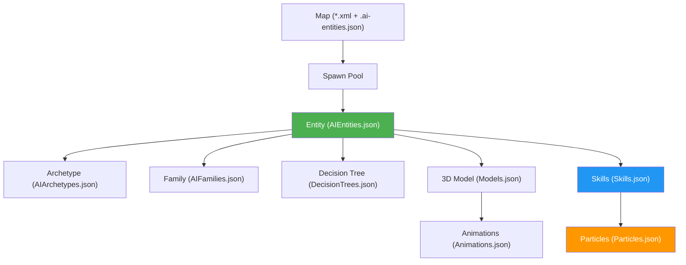

# Content Creator Guide

**For Artists, Designers, and Non-Programmers**

This guide explains how to add new content to the game without writing code. All game content is defined in JSON files that you can edit with any text editor.

---

## Quick Start: Where Are Things?

All game data lives in `Pomo.Core/Content/`:

| What You Want to Add       | File to Edit         |
| -------------------------- | -------------------- |
| New character/enemy        | `AIEntities.json`    |
| Character personality/AI   | `AIArchetypes.json`  |
| New ability/spell          | `Skills.json`        |
| Visual effects (particles) | `Particles.json`     |
| 3D model rig               | `Models.json`        |
| Character animations       | `Animations.json`    |
| Equipment/items            | `Items.json`         |
| AI behavior logic          | `DecisionTrees.json` |
| Character stat scaling     | `AIFamilies.json`    |

---

## The Big Picture: How Everything Connects



**Reading the diagram:**

- Maps spawn entities from **spawn pools**
- Each **entity** (character) references an archetype, family, decision tree, model, and skills
- **Models** reference animations
- **Skills** reference visual effects (particles)

---

## Step-by-Step: Adding a New Character

### 1. Define the Entity

Open `AIEntities.json` and add your character:

```json
"MyNewWarrior": {
  "Name": "Shadow Knight",
  "ArchetypeId": 1,
  "Family": "Power",
  "Skills": [1, 16],
  "DecisionTree": "MeleeAttacker",
  "Model": "HumanoidBase"
}
```

| Property       | What It Does             | Where Values Come From |
| -------------- | ------------------------ | ---------------------- |
| `Name`         | Display name in game     | Your choice            |
| `ArchetypeId`  | Personality & base stats | `AIArchetypes.json`    |
| `Family`       | Stat scaling group       | `AIFamilies.json`      |
| `Skills`       | List of skill IDs        | `Skills.json`          |
| `DecisionTree` | How AI makes decisions   | `DecisionTrees.json`   |
| `Model`        | Visual appearance        | `Models.json`          |

### 2. Choose an Archetype (or Create One)

Archetypes define **personality** and **perception**. Check `AIArchetypes.json`:

| Existing ID | Name             | Behavior                                 |
| ----------- | ---------------- | ---------------------------------------- |
| 1           | Basic Enemy      | Aggressive, sees 360°, attacks on sight  |
| 2           | Patrolling Guard | Cautious, investigates, returns to spawn |
| 3           | Tower            | Stationary, attacks from range           |

> [!TIP]
> Start with an existing archetype. Only create new ones when you need different perception or behavior settings.

📖 **Full details:** [AIArchetypesConfigReference.md](AIArchetypesConfigReference.md)

### 3. Assign a Family

Families control **stat scaling**. Check `AIFamilies.json`:

| Family | Strengths              | Best For          |
| ------ | ---------------------- | ----------------- |
| Magic  | High Magic, Sense      | Mages, casters    |
| Power  | High Power, some Charm | Warriors, tanks   |
| Charm  | High Charm, some Magic | Supports, healers |
| Sense  | High Sense, some Power | Rogues, hunters   |

### 4. Pick a Decision Tree

Decision trees control **combat AI**. Check `DecisionTrees.json`:

| Tree             | Behavior                                  |
| ---------------- | ----------------------------------------- |
| `MeleeAttacker`  | Chases and attacks in melee range         |
| `RangedCaster`   | Keeps distance, uses ranged abilities     |
| `SupportBuffer`  | Heals self, debuffs enemies               |
| `TacticalRanged` | Retreats if too close, attacks from range |
| `Turret`         | Stays in place, shoots anything in range  |

### 5. Add to a Map Spawn Pool

To make your character appear in a map, edit the map's `.ai-entities.json` file (e.g., `Maps/Proto.ai-entities.json`):

```json
"my_custom_enemies": {
  "Entities": ["MyNewWarrior", "Berserker"],
  "Weights": [0.6, 0.4],
  "Overrides": {}
}
```

- **Entities**: List of entity IDs from `AIEntities.json`
- **Weights**: How often each spawns (must add to 1.0)
- **Overrides**: Optional per-spawn customizations

Then, in the map editor (Tiled), create a spawn zone that references `"my_custom_enemies"`.

---

## Step-by-Step: Adding a New Skill

### 1. Create the Skill Definition

Open `Skills.json` and add your skill:

```json
"25": {
  "Kind": "Active",
  "Id": 25,
  "Name": "Lightning Bolt",
  "Description": "Strikes a single target with lightning.",
  "Intent": "Offensive",
  "DamageSource": "Magical",
  "Cost": { "Type": "MP", "Amount": 15 },
  "Cooldown": 2.0,
  "Targeting": "TargetEntity",
  "Range": [16, 10],
  "Area": "Point",
  "Delivery": {
    "Type": "Projectile",
    "Speed": 200.0,
    "CollisionMode": "IgnoreTerrain",
    "Visuals": { "Vfx": "LightningBoltProjectile" }
  },
  "ImpactVisuals": { "Vfx": "LightningBoltImpact" },
  "ElementFormula": { "Element": "Lightning", "Formula": "MA * 1.2" }
}
```

### 2. Choose Targeting Mode

| Mode              | Use When                        |
| ----------------- | ------------------------------- |
| `Self`            | Buffs, shields on yourself      |
| `TargetEntity`    | Click on an enemy/ally          |
| `TargetPosition`  | Click on ground (AoE placement) |
| `TargetDirection` | Aim a cone/line                 |

### 3. Choose Delivery Type

| Type         | Visual Result                           |
| ------------ | --------------------------------------- |
| `Instant`    | Effect happens immediately at target    |
| `Projectile` | Ball flies toward target, then explodes |

### 4. Create the Particle Effects

If your skill has `Visuals.Vfx` or `ImpactVisuals.Vfx`, create matching entries in `Particles.json`.

📖 **Full details:** [SkillsConfigReference.md](SkillsConfigReference.md) and [ParticleConfigReference.md](ParticleConfigReference.md)

### 5. Assign to a Character

In `AIEntities.json`, add your skill ID to a character's `Skills` array:

```json
"IceMage": {
  "Skills": [11, 20, 25]  // Added skill 25
}
```

---

## Step-by-Step: Adding Visual Effects (Particles)

### 1. Understand Particle Types

| Purpose              | When to Use                      |
| -------------------- | -------------------------------- |
| **Projectile Trail** | Effect follows a flying object   |
| **Impact Burst**     | One-time explosion on hit        |
| **Aura/Loop**        | Continuous effect on a character |

### 2. Create a Particle Emitter

Open `Particles.json`:

```json
{
  "Name": "LightningBoltProjectile",
  "Texture": "jellyfish0-masks/40",
  "BlendMode": "Additive",
  "SimulationSpace": "World",
  "Rate": 100,
  "Shape": "Point",
  "Particle": {
    "Lifetime": [0.2, 0.4],
    "Speed": [5, 15],
    "Gravity": 0.0,
    "SizeStart": 1.5,
    "SizeEnd": 0.5,
    "ColorStart": "#FFFFAAFF",
    "ColorEnd": "#FFFF0000"
  }
}
```

### 3. Key Particle Decisions

| Setting             | Option A                        | Option B                          |
| ------------------- | ------------------------------- | --------------------------------- |
| **BlendMode**       | `AlphaBlend` (smoke, opaque)    | `Additive` (fire, glow, magic)    |
| **SimulationSpace** | `World` (particles stay behind) | `Local` (particles follow object) |
| **Gravity**         | Positive (falls down)           | Negative (rises up)               |

📖 **Full details:** [ParticleConfigReference.md](ParticleConfigReference.md)

---

## Step-by-Step: Adding a New 3D Model

### 1. Prepare Your Model Files

Export your 3D model parts as separate `.fbx` files and place them in `Content/3d_models/`.

### 2. Register in the Content Pipeline

Add entries to `Content/Pomo.mgcb` (the content pipeline definition).

### 3. Define the Rig

Open `Models.json` and create your model configuration:

```json
"MyCustomCharacter": {
  "Rig": {
    "Root": { "Model": "MyChar_Base" },
    "Body": { "Model": "MyChar_Body", "Parent": "Root" },
    "Head": { "Model": "MyChar_Head", "Parent": "Body" },
    "Arm_L": {
      "Model": "MyChar_ArmL",
      "Parent": "Body",
      "Pivot": { "X": 0.0, "Y": 1.5, "Z": 0.0 }
    },
    "Arm_R": {
      "Model": "MyChar_ArmR",
      "Parent": "Body",
      "Pivot": { "X": 0.0, "Y": 1.5, "Z": 0.0 }
    }
  },
  "AnimationBindings": {
    "Run": ["Arm_Swing", "Run_Bounce"]
  }
}
```

> [!IMPORTANT] > **Pivots are critical!** Pivot values depend on your model's design—they define the point a part rotates around (e.g., the shoulder joint for an arm). Without correct pivots, parts rotate around the wrong point. Check your model's coordinate space to find where joints are located. The example uses `Y: 1.5` because our current models have their origin at the feet and shoulder height is at 1.5 units—your models may differ.

📖 **Full details:** [ModelsConfigReference.md](ModelsConfigReference.md)

---

## Step-by-Step: Adding Animations

### 1. Create Animation Clips

Open `Animations.json`:

```json
"My_Attack_Swing": {
  "Duration": 0.6,
  "Loop": false,
  "Tracks": {
    "Arm_R": [
      { "Time": 0.0, "Rotation": { "Y": 0, "Z": 0 } },
      { "Time": 0.3, "Rotation": { "Y": -60, "Z": 30 } },
      { "Time": 0.6, "Rotation": { "Y": 0, "Z": 0 } }
    ]
  }
}
```

### 2. Understanding Rotation Axes

| Axis  | Motion                 | Example                   |
| ----- | ---------------------- | ------------------------- |
| **Y** | Forward/Backward swing | Arm reaching forward      |
| **Z** | Up/Down wave           | Arm waving hello          |
| **X** | Twist/Roll             | Arm rotating like a drill |

### 3. Bind to Model State

In `Models.json`, add your animation to the bindings:

```json
"AnimationBindings": {
  "Run": ["Arm_Swing", "Run_Bounce"],
  "Attack": ["My_Attack_Swing"]
}
```

📖 **Full details:** [AnimationsConfigReference.md](AnimationsConfigReference.md)

---

## Complete Example: Creating "Storm Archer"

Here's everything needed for a new ranged character:

### 1. Entity (`AIEntities.json`)

```json
"StormArcher": {
  "Name": "Storm Archer",
  "ArchetypeId": 1,
  "Family": "Sense",
  "Skills": [17, 26],
  "DecisionTree": "TacticalRanged",
  "Model": "HumanoidBase"
}
```

### 2. New Skill (`Skills.json`)

```json
"26": {
  "Kind": "Active",
  "Id": 26,
  "Name": "Storm Arrow",
  "Description": "An arrow charged with lightning that chains to nearby enemies.",
  "Intent": "Offensive",
  "DamageSource": "Physical",
  "Cost": { "Type": "MP", "Amount": 20 },
  "Cooldown": 4.0,
  "Targeting": "TargetEntity",
  "Range": [16, 12],
  "Area": "Point",
  "Delivery": {
    "Type": "Projectile",
    "Speed": 180.0,
    "CollisionMode": "BlockedByTerrain",
    "Visuals": { "Vfx": "StormArrowProjectile" },
    "Kind": { "Type": "Chained", "JumpsLeft": 3, "MaxRange": 64.0 }
  },
  "ImpactVisuals": { "Vfx": "LightningBoltImpact" },
  "ElementFormula": { "Element": "Lightning", "Formula": "(AP * 0.8) + (SenseA * 500)" }
}
```

### 3. Projectile Particle (`Particles.json`)

```json
{
  "Name": "StormArrowProjectile",
  "Texture": "jellyfish0-masks/40",
  "BlendMode": "Additive",
  "SimulationSpace": "World",
  "Rate": 80,
  "Shape": "Point",
  "LocalOffset": { "X": 0, "Y": 0.5, "Z": 0 },
  "Particle": {
    "Lifetime": [0.15, 0.3],
    "Speed": [8, 20],
    "Gravity": 0.0,
    "SizeStart": 1.2,
    "SizeEnd": 0.3,
    "ColorStart": "#88CCFFFF",
    "ColorEnd": "#0088FF00",
    "RandomVelocity": { "X": 5, "Y": 5, "Z": 5 }
  }
}
```

### 4. Add to Spawn Pool (`Maps/Proto.ai-entities.json`)

```json
"ranged_attackers": {
  "Entities": ["Sniper", "Assassin", "StormArcher"],
  "Weights": [0.35, 0.35, 0.30],
  "Overrides": {}
}
```

---

## Reference Documents

For detailed information on each config file:

| Topic                       | Reference                                                        |
| --------------------------- | ---------------------------------------------------------------- |
| AI personality & perception | [AIArchetypesConfigReference.md](AIArchetypesConfigReference.md) |
| Abilities & spells          | [SkillsConfigReference.md](SkillsConfigReference.md)             |
| Visual effects              | [ParticleConfigReference.md](ParticleConfigReference.md)         |
| 3D model rigs               | [ModelsConfigReference.md](ModelsConfigReference.md)             |
| Keyframe animations         | [AnimationsConfigReference.md](AnimationsConfigReference.md)     |
| Equipment & consumables     | [ItemsConfigReference.md](ItemsConfigReference.md)               |

---

## Troubleshooting

### "My character doesn't appear in the game"

1. Check that the entity ID is spelled exactly the same in `AIEntities.json` and the spawn pool
2. Verify the spawn pool is referenced in the map's spawn zones
3. Check the spawn weights add up to 1.0

### "My skill doesn't do damage"

1. Make sure `Formula` or `ElementFormula` is defined
2. Check that the skill ID is in the character's `Skills` array
3. Verify `Intent` is "Offensive" for damage skills

### "Particles don't show up"

1. Confirm the `Vfx` name in Skills.json exactly matches the `Name` in Particles.json
2. Check if `Burst` or `Rate` is set (one must be > 0)
3. Verify the texture path exists

### "Animation looks weird"

1. Check if `Pivot` is set correctly for rotating parts
2. Verify the first and last keyframes match for looping animations
3. Try smaller rotation values (15-30 degrees) first
